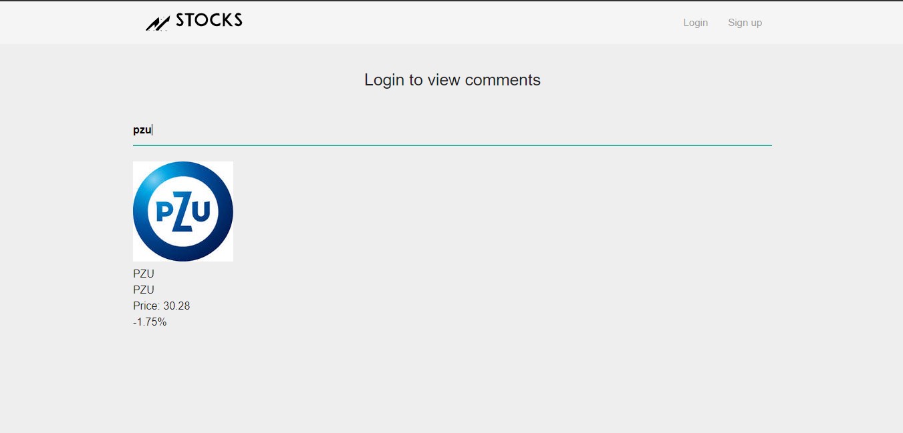
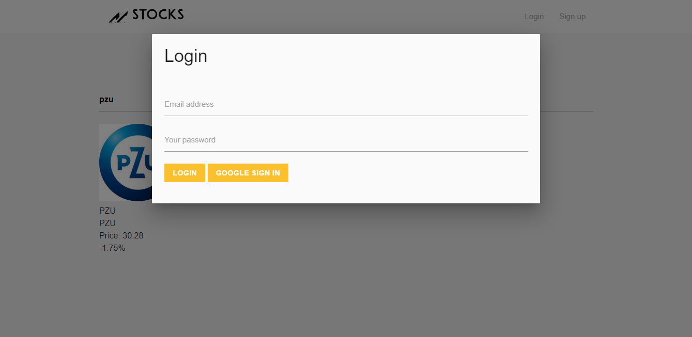
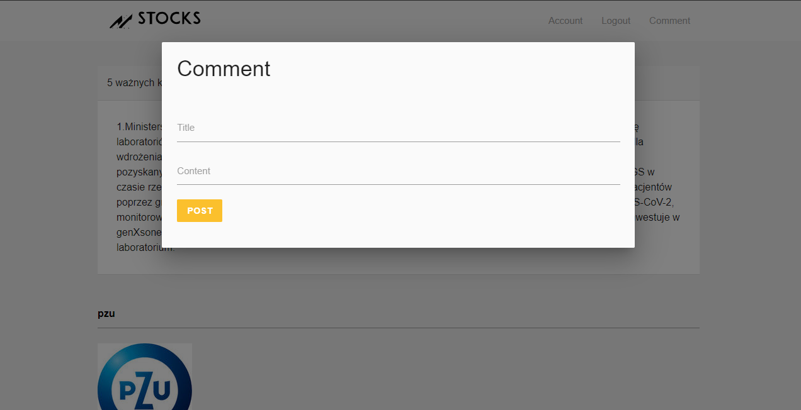
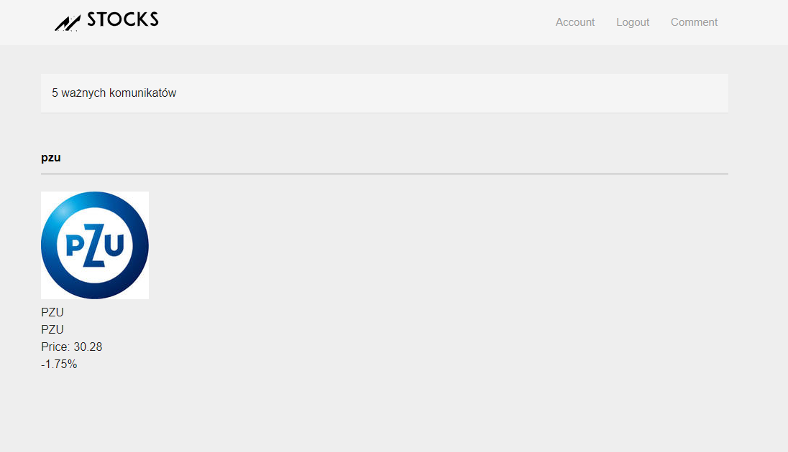

## Stocks

Aplikacja do śledzenia kursów giełdowych umożliwia łatwe i przejrzyste obserwowanie statystyk dotyczących spółek na giełdzie. Firmy i indeksy giełdowe można wyszukiwać po nazwie. Spółki posiadają swoje profile, na których znajdują się dane i kurs akcji. Funkcja komentarzy pozwala na publikacje przez użytkowników postów.

